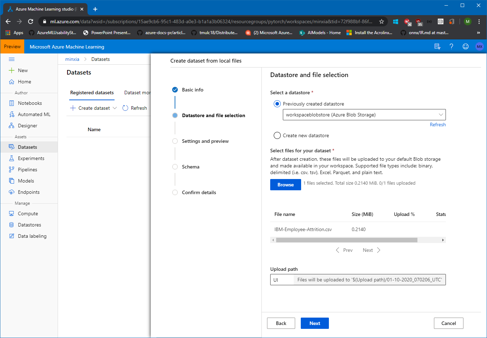
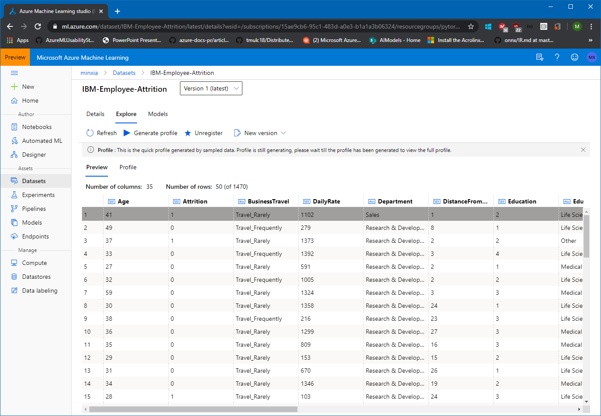
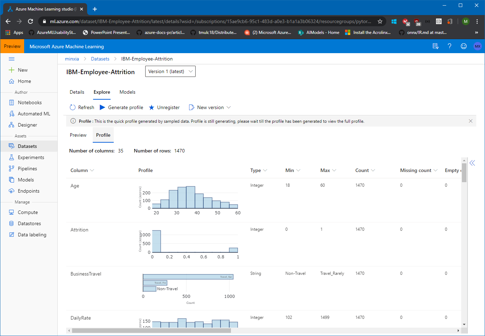

# Datasets and Datastores

The AzureML studio allows the user to manage their dataset and datastores directly inside the portal. 

A Dataset is a resource for exploring, transforming and managing data in Azure Machine Learning. 
Datasets enable:

- Easy access to data: without worrying about connection strings or data paths. Only keep a single copy of data in the storage service of your choice.

- Training with big data: seamless integration with Azure Machine Learning features like labelling, training products and pipelines. Users can share and reuse datasets in various experiments.

- Tracking data usage: Azure ML automatically tracks which version of the dataset was used for the ML experiment and produced which model.

## Uploading a Dataset to AzureML studio

1. Download the IBM Attrition dataset by clicking on this link: https://raw.githubusercontent.com/lucazav/azureml-workshop-2019/master/data/IBM-Employee-Attrition.csv and saving the file to disk.

1. Navigate to the left pane of your workspace. Select Datasets under the Assets section. 

Click on 'Create dataset' and choose 'From local files'. Name the dataset '**IBM-Employee-Attrition**' and then click 'Next'. Make sure to leave the dataset type as Tabular.

1. Click 'Browse', choose the file you had downloaded, and click 'Next' to create the dataset in the workspace's default Blob storage.

1. Click 'Next' through the following "Settings and preview" and "Schema" sections to verify that everything looks correct.

1. Finally, in the "Confirm Details" section, select "Profile this dataset after creation" and specify the 'cpu-cluster' that you previously created as the compute to use for profiling.

## Explore the dataset

1. Now, click on the newly created dataset and click 'Explore'. Here you can see the fields of the Tabular dataset.

1. To view the profile of the dataset we generated in the previous step, click the "Profile" tab. If you want to regenerate a profile (or you created the dataset without selecting the profile option), you can  click "Generate profile" and select a cluster to generate profile information for the dataset.

For more information on datasets, see the how-to for more information on creating and using Datasets. https://docs.microsoft.com/en-us/azure/machine-learning/service/how-to-create-register-datasets.

The following Datasets types are supported:

* [TabularDataset](https://docs.microsoft.com/en-us/python/api/azureml-core/azureml.data.tabulardataset?view=azure-ml-py) represents data in a tabular format created by parsing the provided file or list of files.

* [FileDataset](https://docs.microsoft.com/en-us/python/api/azureml-core/azureml.data.filedataset?view=azure-ml-py) references single or multiple files in datastores or from public URLs.
